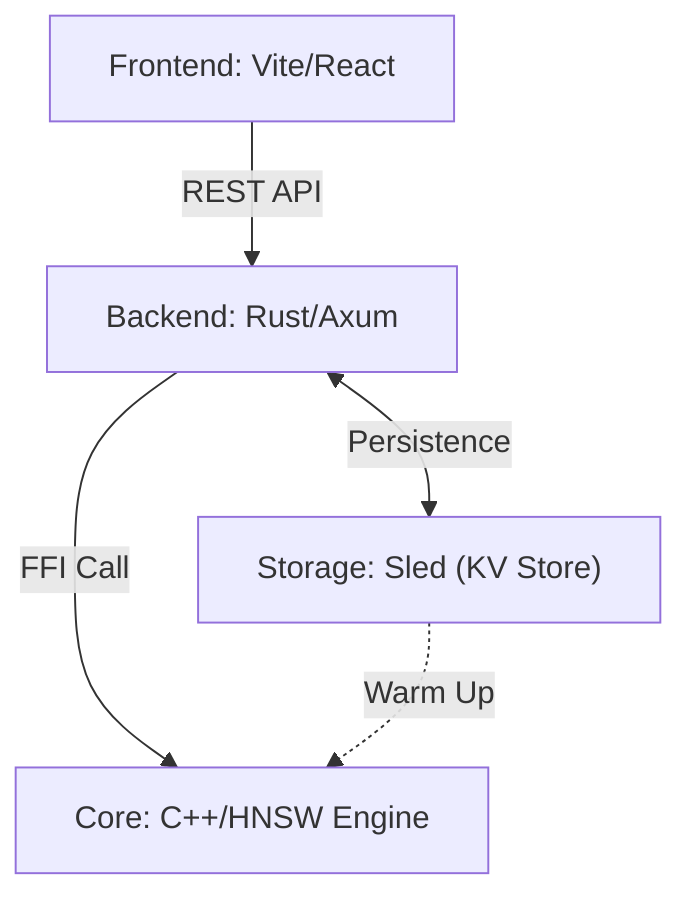

# Mini-RecSys: Hybrid Rust/C++ Recommendation System

A high-performance, full-stack recommendation system demo featuring a **Rust** web server, an **HNSW-powered (C++)** calculation engine, and a **Vite/React** frontend. This project demonstrates practical FFI (Foreign Function Interface) usage and modern system architecture.

## 🌟 Key Features

-   **Hybrid Architecture**: Combines Rust's safety and concurrency with C++'s low-level performance.
-   **HNSW Vector Search**: High-performance approximate nearest neighbor search powered by [hnswlib](https://github.com/nmslib/hnswlib).
-   **Advanced FFI**: Optimized memory interaction for vector operations with zero-copy views for index building.
-   **Persistent Storage**: Integrated **Sled (KV Engine)** for fast, thread-safe data persistence on Windows.
-   **Refined Scoring**: Multi-stage ranking combining C++ vector similarity (Recall) with business logic (Popularity weighting).
-   **Smart Data Generation**: Category-based embedding system with L2 normalization and spatial noise.
-   **Modern Web Stack**: Full-stack integration with Axum (Backend) and Vite (Frontend).

## 🏗️ System Architecture



### Component Breakdown

1.  **C++ HNSW Engine (`cpp/`)**:
    -   Uses **hnswlib** for efficient sub-linear time vector search.
    -   Implements `hnsw_init`, `hnsw_add_item`, and `hnsw_search_knn` with thread-safety.
2.  **Persistent Storage (`src/storage.rs`)**:
    -   Powered by **Sled**, a high-performance embedded database.
    -   Ensures data survives restarts and avoids redundant JSON parsing.
3.  **Rust FFI Layer (`src/ffi.rs`)**:
    -   Safe Rust wrappers for the C++ HNSW engine.
    -   Handles complex interaction protocols and provides `HnswConfig`.
4.  **Rust Web Service (`src/main.rs`, `src/model.rs`)**:
    -   Asynchronous API endpoints powered by **Tokio** and **Axum**.
    -   Coordinates Storage, HNSW Indexing, and the Recommendation Pipeline.
5.  **Frontend (`frontend/`)**:
    -   Modern UI for visualizing recommendations and user switching.

## 🚀 Getting Started

### Prerequisites

-   **Rust**: 1.75+ (Edition 2021)
-   **C++ Compiler**: GCC 9+, Clang 10+, or MSVC 2019+ (Support for C++17)
-   **Node.js**: 18+ (for frontend)

### Installation & Run

1.  **Clone and build the backend:**
    ```bash
    cargo build --release
    cargo run
    ```
    *Server will start at `http://localhost:3000`*

2.  **Start the frontend:**
    ```bash
    cd frontend
    npm install
    npm run dev
    ```
    *UI will be available at `http://localhost:5173`*

## 📊 Technical Deep Dive

### 1. Approximate Nearest Neighbor Search (HNSW)
The system has transitioned from brute-force search to **HNSW (Hierarchical Navigable Small World)**. This allows for extremely fast searches even with millions of items by navigating a layered graph of embeddings.

| Parameter | Recommended | Description |
| :--- | :--- | :--- |
| `M` | `16` | Max connections per node (accuracy vs memory) |
| `ef_construction` | `200` | Search depth during index build |
| `ef_search` | `100` | Search depth during query |

### 2. Embedding System
Unlike random initialization, our system generates embeddings based on orthogonal category anchors (Electronics, Books, Home, Clothing).
-   **Users**: Represented by a mixture of their preferred category vectors.
-   **Items**: Generated with category-specific base vectors + L2 normalized noise.

### 3. API Endpoints

| Method | Endpoint | Description |
| :--- | :--- | :--- |
| `GET` | `/users` | List all available demo users |
| `GET` | `/recommend?uid={id}` | Get Top-10 personalized recommendations (HNSW Recall) |
| `GET` | `/health` | Server health check |

## 📦 Core Dependencies

-   `hnswlib`: Header-only C++ library for ANN search.
-   `axum` & `tokio`: High-performance async web framework.
-   `serde`: Robust serialization for JSON data.
-   `cc`: Integrated build-time C++ compilation.
-   `tower-http`: Middleware for CORS and security.

## 💡 Learning Objectives
1.  Mastering **FFI Boundaries**: Understanding `unsafe` and pointer safety.
2.  **Vector Databases**: Implementing the core logic found in systems like Pinecone or Milvus.
3.  **HNSW Algorithm**: Tuning parameters for speed vs precision trade-offs.
4.  **Full-stack System Design**: Connecting low-level engines to modern UIs.

---
**Mini-RecSys** - Built with ❤️ for systems programming enthusiasts.
