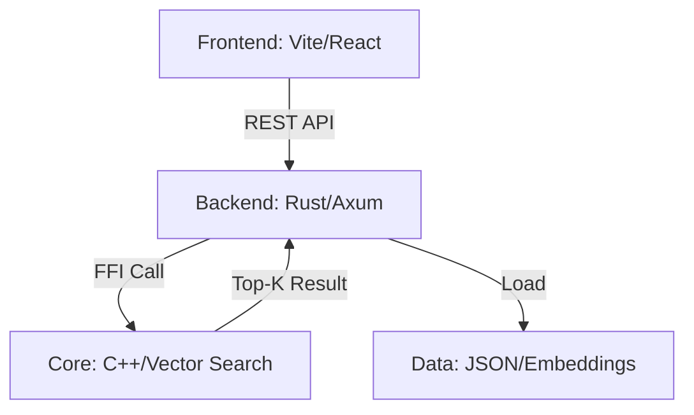

# Mini-RecSys: Hybrid Rust/C++ Recommendation System

A high-performance, full-stack recommendation system demo featuring a **Rust** web server, a **C++** calculation engine, and a **Vite/React** frontend. This project demonstrates practical FFI (Foreign Function Interface) usage and modern system architecture.

## 🌟 Key Features

-   **Hybrid Architecture**: Combines Rust's safety and concurrency with C++'s low-level performance.
-   **Advanced FFI**: Optimized memory interaction for vector operations (Zero-copy views where possible).
-   **Refined Scoring**: Multi-stage ranking combining C++ vector similarity (Recall) with business logic (Popularity weighting).
-   **Smart Data Generation**: Category-based embedding system with L2 normalization and spatial noise.
-   **Modern Web Stack**: Full-stack integration with Axum (Backend) and Vite (Frontend).

## 🏗️ System Architecture



### Component Breakdown

1.  **C++ Calculation Core (`cpp/`)**:
    -   Implements high-performance `search_top_k` using `std::partial_sort`.
    -   Handles flat-matrix memory layout for cache-friendly vector operations.
2.  **Rust FFI Layer (`src/ffi.rs`)**:
    -   Exposes safe wrappers for C++ functions.
    -   Manages memory alignment and pointer safety during cross-boundary calls.
3.  **Rust Web Service (`src/main.rs`, `src/service.rs`)**:
    -   Asynchronous API endpoints powered by **Tokio** and **Axum**.
    -   Implements the "Recall -> Rank" pipeline.
4.  **Frontend (`frontend/`)**:
    -   Modern UI for visualizing recommendations and user switching.

## 🚀 Getting Started

### Prerequisites

-   **Rust**: 1.75+ (Edition 2021)
-   **C++ Compiler**: GCC 9+, Clang 10+, or MSVC 2019+
-   **Node.js**: 18+ (for frontend)

### Installation & Run

1.  **Clone and build the backend:**
    ```bash
    cargo build --release
    cargo run
    ```
    *Server will start at `http://localhost:3000`*

2.  **Start the frontend:**
    ```bash
    cd frontend
    npm install
    npm run dev
    ```
    *UI will be available at `http://localhost:5173`*

## 📊 Technical Deep Dive

### 1. Memory Interaction Protocol
The project uses a "Flattened Matrix" layout. All item embeddings are merged into a single contiguous `Vec<f32>` before being passed to C++. This allows C++ to iterate through data with minimal cache misses.

### 2. Embedding System
Unlike random initialization, our system generates embeddings based on orthogonal category anchors (Electronics, Books, Home, Clothing).
-   **Users**: Represented by a mixture of their preferred category vectors.
-   **Items**: Generated with category-specific base vectors + L2 normalized noise.

### 3. API Endpoints

| Method | Endpoint | Description |
| :--- | :--- | :--- |
| `GET` | `/users` | List all available demo users |
| `GET` | `/recommend?uid={id}` | Get Top-10 personalized recommendations |
| `GET` | `/health` | Server health check |

## 📦 Core Dependencies

-   `axum` & `tokio`: High-performance async web framework.
-   `serde`: Robust serialization for JSON data.
-   `cc`: Integrated build-time C++ compilation.
-   `tower-http`: Middleware for CORS and security.
-   `libc`: Native system types for FFI.

## 💡 Learning Objectives
1.  Mastering **FFI Boundaries**: Understanding `unsafe` and pointer safety.
2.  **Build System Integration**: Configuring `build.rs` for hybrid builds.
3.  **Performance Optimization**: Reducing memory allocation in hot loops.
4.  **Full-stack System Design**: Connecting low-level engines to modern UIs.

---
**Mini-RecSys** - Built with ❤️ for systems programming enthusiasts.
