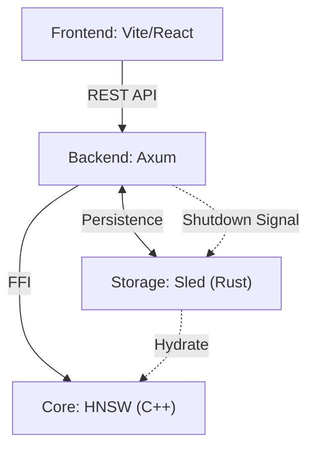

# Mini-RecSys: Hybrid Rust/C++ Recommendation System

A high-performance, full-stack recommendation system demo featuring a **Rust** web server, an **HNSW-powered (C++)** calculation engine, and a **Vite/React** frontend. This project demonstrates practical FFI (Foreign Function Interface) usage and modern system architecture.

## 🌟 Key Features

-   **Hybrid Architecture**: Combines Rust's safety and concurrency with C++'s low-level performance.
-   **HNSW Vector Search**: High-performance approximate nearest neighbor search powered by [hnswlib](https://github.com/nmslib/hnswlib).
-   **Hybrid Architecture**: Combines Rust's safety and concurrency with C++'s low-level performance.
-   **HNSW Vector Search**: High-performance approximate nearest neighbor search powered by [hnswlib](https://github.com/nmslib/hnswlib).
-   **Full Persistence**: 
    -   **Sled (KV Engine)**: Persists user/item metadata and popularity.
    -   **HNSW Serialization**: Native C++ serialization for vector index stability.
-   **Advanced Lifecycle**: 
    -   **Startup Hydration**: Automatic consistency check and index rebuilding from DB.
    -   **Graceful Shutdown**: Signal handling (Ctrl+C) to ensure data flush and index saving.
-   **Smart Data Generation**: Category-based orthogonal embedding system with L2 normalization.
-   **Modern Web Stack**: Full-stack integration with Axum (Backend) and Vite/React (Frontend).

## 🏗️ System Architecture



### Component Breakdown

1.  **C++ HNSW Engine (`cpp/`)**:
    -   Uses **hnswlib** for sub-linear time vector search.
    -   Implements `hnsw_save_index` and `hnsw_load_index` for disk persistence.
2.  **Persistent Storage (`src/storage.rs`)**:
    -   Powered by **Sled**, a high-performance embedded database.
    -   Ensures item/user data survives restarts.
3.  **Rust FFI Layer (`src/ffi.rs`)**:
    -   Safe Rust wrappers for the C++ engine managing raw pointers and C-strings.
4.  **Rust Web Service (`src/main.rs`)**:
    -   Orchestrates the lifecycle: `init_hnsw_with_hydration` on start and `graceful_shutdown` on exit.
5.  **Frontend (`frontend/`)**:
    -   Modern dashboard with real product images and performance metrics.

## 🚀 Getting Started

### Prerequisites

-   **Rust**: 1.75+ (Edition 2021)
-   **C++ Compiler**: Support for C++17 (GCC 9+, Clang 10+, or MSVC 2019+)
-   **Node.js**: 18+

### Installation & Run

1.  **Launch the backend:**
    ```bash
    cargo run
    ```
    *Server starts at `http://localhost:3000`. On first run, it imports `assets/products.json`.*

2.  **Launch the frontend:**
    ```bash
    cd frontend
    npm install
    npm run dev
    ```
    *Dashboard available at `http://localhost:5173`*

## 📊 Technical Deep Dive

### 1. Persistence & Hydration
The system maintains two types of storage:
-   **Metadata (Sled)**: The "Source of Truth" in Rust.
-   **Vector Index (HNSW)**: The search optimization structure in C++.
On startup, the system performs **Hydration**: it loads the index from disk and verifies the element count against Sled. If inconsistent, it automatically rebuilds the index from Sled items.

### 2. Graceful Shutdown
Using `tokio::signal::ctrl_c`, the system intercepts exit signals to:
1.  Serialize the HNSW index to `data/index.bin`.
2.  Flush Sled database buffers to disk.
3.  Standardize the shutdown sequence to prevent data corruption.

### 3. Embedding System
Orthogonal category anchors (Electronics, Books, Home, Clothing) ensure mathematical separation in the 64D space, resulting in highly distinct recommendation clusters.

## 📦 Core Dependencies

-   `hnswlib`: Header-only C++ library for ANN search.
-   `sled`: Embedded KV database.
-   `axum` & `tokio`: Async web and signal handling.
-   `serde` & `bincode`: JSON and binary serialization.
-   `cc`: FFI build-time compilation.

---
**Mini-RecSys** - Built with ❤️ for systems programming enthusiasts.
