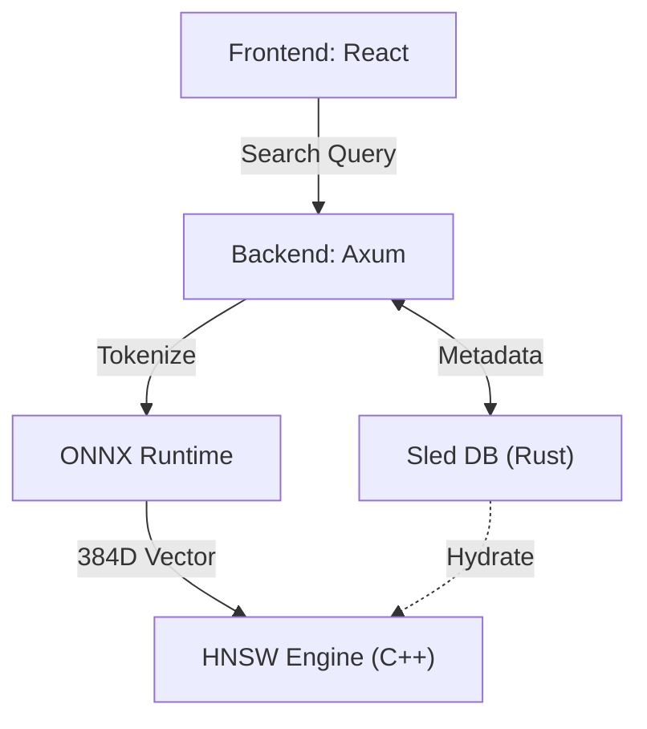

# Mini-RecSys: AI-Powered Hybrid Recommendation System

A high-performance recommendation system featuring a **Rust** web server, an **ONNX-driven AI** embedding engine, an **HNSW-powered (C++)** search engine, and a **Vite/React** frontend.

## 🌟 Key Features

-   **Semantic Search**: Real-time semantic vector search using ONNX Runtime (BERT `all-MiniLM-L6-v2`).
-   **Hybrid Architecture**: Blends Rust's safety, C++'s search performance, and Python-trained models' intelligence.
-   **HNSW Vector Search**: Sub-linear ANN search (384-dimensional space) via [hnswlib](https://github.com/nmslib/hnswlib).
-   **Full Persistence**: 
    -   **Sled (KV Engine)**: Persists user/item metadata and popularity.
    -   **HNSW Serialization**: Binary index persistence for sub-second startup response.
-   **Smart Lifecycle**: Automatic index hydration from Sled and graceful index saving on shutdown.

## 🏗️ System Architecture



## 🚀 Getting Started

### Prerequisites

-   **Rust**: 1.75+
-   **C++ Compiler**: Support for C++17
-   **Node.js**: 18+
-   **Models**: Place `all-MiniLM-L6-v2.onnx` and `tokenizer.json` in `/models`.

### Installation

1.  **Initialize Backend**:
    ```bash
    cargo run --release
    ```
2.  **Initialize Frontend**:
    ```bash
    cd frontend && npm install && npm run dev
    ```

## 📊 Technical Components

-   **AI Embedding (`src/embedding.rs`)**: Uses `ort` crate to run BERT models. Implements Mean Pooling and L2 Normalization.
-   **C++ Engine (`cpp/`)**: FFI-wrapped HNSW index for high-speed retrieval.
-   **Storage (`src/storage.rs`)**: ACID-compliant metadata storage.

---
**Mini-RecSys** - Intelligent recommendation through systems engineering.
