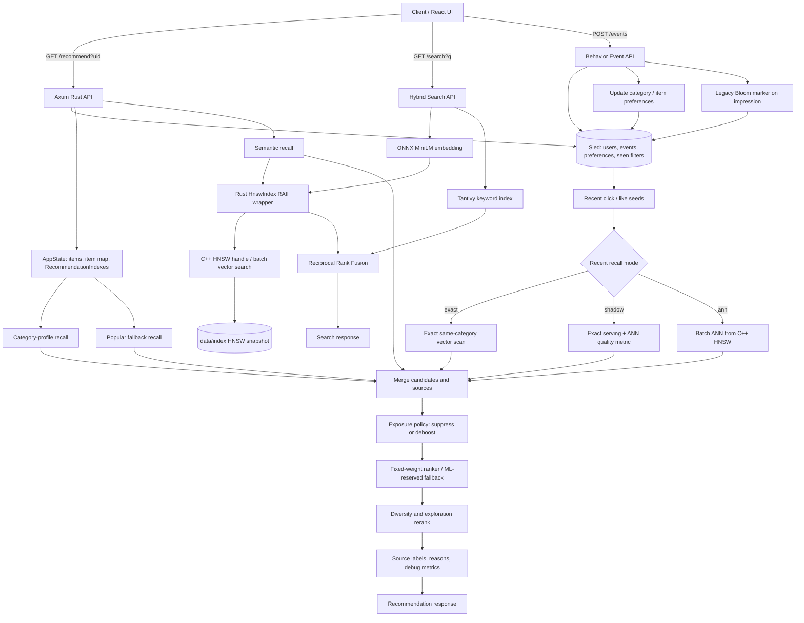

# Mini-RecSys

Mini-RecSys is a lightweight recommendation-system MVP built with a Rust/Axum
backend, a C++ HNSW vector-search layer, ONNX Runtime embeddings, Tantivy text
search, Sled persistence, and a Vite/React frontend.

The current backend implements an explainable Phase 1 recommendation pipeline:

```text
Recall -> Rank -> Rerank -> Explain
```

It also includes a Phase 2 feedback loop for behavior events, lightweight
preference updates, and recommendation debugging. The system remains small and
rule-driven: it avoids large-scale model training infrastructure while keeping a
clear extension point for future machine-learning ranking.

## Recommendation Architecture

The service is a single Rust API process that orchestrates storage, recall,
ranking, reranking, and explanation. C++ owns the HNSW/vector-search kernel,
while Rust owns request handling, exposure policy, merging, ranking, and debug
output.


```mermaid
flowchart TD
    Client[Client / React UI] -->|GET /recommend?uid| Axum[Axum Rust API]
    Client -->|GET /search?q| SearchApi[Hybrid Search API]
    Client -->|POST /events| Events[Behavior Event API]

    Axum --> Storage[(Sled: users, events, preferences, seen filters)]
    Axum --> AppState[AppState: items, item map, RecommendationIndexes]
    Axum --> Semantic[Semantic recall]
    Semantic --> HnswRust[Rust HnswIndex RAII wrapper]
    HnswRust --> HnswCpp[C++ HNSW handle / batch vector search]
    HnswCpp --> HnswFile[(data/index HNSW snapshot)]

    AppState --> Category[Category-profile recall]
    AppState --> Popular[Popular fallback recall]
    Storage --> RecentSeeds[Recent click / like seeds]
    RecentSeeds --> RecentMode{Recent recall mode}
    RecentMode -->|exact| RecentExact[Exact same-category vector scan]
    RecentMode -->|shadow| RecentShadow[Exact serving + ANN quality metric]
    RecentMode -->|ann| RecentAnn[Batch ANN from C++ HNSW]

    Semantic --> Merge[Merge candidates and sources]
    Category --> Merge
    Popular --> Merge
    RecentExact --> Merge
    RecentShadow --> Merge
    RecentAnn --> Merge

    Merge --> Exposure[Exposure policy: suppress or deboost]
    Exposure --> Rank[Fixed-weight ranker / ML-reserved fallback]
    Rank --> Rerank[Diversity and exploration rerank]
    Rerank --> Explain[Source labels, reasons, debug metrics]
    Explain --> Response[Recommendation response]

    SearchApi --> Embed[ONNX MiniLM embedding]
    Embed --> HnswRust
    SearchApi --> Tantivy[Tantivy keyword index]
    HnswRust --> RRF[Reciprocal Rank Fusion]
    Tantivy --> RRF
    RRF --> SearchResponse[Search response]

    Events --> Storage
    Events --> Preferences[Update category / item preferences]
    Events --> SeenWrite[Legacy Bloom marker on impression]
    Preferences --> Storage
    SeenWrite --> Storage
```

Key runtime boundaries:

- `src/init.rs` builds `AppState`, loads local data, hydrates the HNSW index,
  and wires request handlers.
- `src/recommendation/` owns recall, ranking, reranking, explanation, and debug
  contracts.
- `src/ffi.rs` is the only Rust unsafe boundary; safe wrappers expose C++ HNSW
  operations to the service.
- `cpp/vector_ops.cpp` owns HNSW index handles, query-time search, and batch
  vector search.
- `Sled`, `Tantivy`, and HNSW snapshots are local writable state, so the current
  deployment model is single-replica.

## Features

- Multi-source recall:
  - semantic recall from the HNSW vector index
  - popular-item recall
  - category-based recall from user interests and item categories
- Rule-based ranking with semantic score, category match, popularity,
  price affinity, and novelty.
- Ranking strategy extension point:
  - default: `fixed_weights`
  - reserved: `machine_learning_reserved`
- Lightweight reranking:
  - exposure-aware policy that deboosts recent impressions and suppresses
    dismiss/purchase events
  - category diversity in the top results
  - one exploration slot for a relevant non-top-scored item
- Explainable recommendation responses with `source`, `reason`, feature scores,
  and `ranking_strategy`.
- Behavior feedback through `impression`, `click`, `like`, `dismiss`, and
  `purchase` events.
- Persisted recent events and lightweight category/item preference weights.
- Debug output for candidate counts, recall sources, category distribution, and
  source distribution, plus exposure adjustment/suppression counts.
- Kubernetes-oriented service behavior with env-based configuration, live/ready
  probes, Prometheus-style metrics, and container manifests.
- Hybrid search that combines vector search and Tantivy keyword search through
  Reciprocal Rank Fusion.

## Project Structure

```text
src/
  main.rs                 Axum server, route handlers, app state
  embedding.rs            ONNX Runtime embedding inference
  ffi.rs                  Rust bindings for the C++ HNSW layer
  hybrid.rs               RRF fusion for search results
  model.rs                User and item data models
  storage.rs              Sled persistence
  text_search.rs          Tantivy indexing and search
  recommendation/
    mod.rs                Recommendation module exports
    pipeline.rs           Recall, rank, rerank, explain orchestration
    recall.rs             Multi-source candidate generation
    rank.rs               Ranking strategies and scoring
    rerank.rs             Diversity and exploration reranking
    explain.rs            Source and reason labels
    exposure.rs           Exposure deboost/suppression policy
    features.rs           Ranking feature helpers
    types.rs              Pipeline input/output types
    tests.rs              Recommendation unit tests
cpp/                       C++17 HNSW/vector-search implementation
frontend/                  Vite/React UI
models/                    Local ONNX model and tokenizer files
data/                      Local Sled and index persistence
assets/                    Static assets
docs/                      Design notes and expansion plans
```

## Requirements

- Rust 1.75+
- A C++17 compiler
- Node.js 18+
- Local model files:
  - `models/all-MiniLM-L6-v2.onnx`
  - `models/tokenizer.json`

The current tokenizer/model setup is treated as English-only for this MVP.
User profile text, search input, item names, and recommendation explanations
should remain English. Search requests containing CJK text are rejected.

## Running Locally

Start the backend:

```bash
cargo run --release
```

Start the frontend:

```bash
cd frontend
npm install
npm run dev
```

The frontend development server proxies user-facing workflows to the backend
API during local development.

## API Overview

- `GET /recommend?uid=<user_id>`: returns explainable recommendations.
- `GET /search?query=<text>`: runs hybrid vector and keyword search.
- `POST /events`: records one behavior event and updates preferences.
- `POST /mark_seen`: records legacy seen markers and appends impressions for
  known item IDs.
- `GET /debug/recommendation?uid=<user_id>`: returns recommendation debug data.
- `GET /livez`: process liveness probe.
- `GET /readyz`: readiness probe that succeeds after storage, indexes, model
  loading, and embedding warmup complete.
- `GET /health`: compatibility health response.
- `GET /metrics`: Prometheus-style service metrics.

Recommendation items include ranking features and explanation fields such as:

```json
{
  "item_id": 1,
  "semantic_score": 0.82,
  "category_score": 1.0,
  "popularity": 0.45,
  "price_affinity": 0.91,
  "novelty": 0.55,
  "feedback_score": 0.4,
  "final_score": 0.73,
  "ranking_strategy": "fixed_weights",
  "source": "semantic+category",
  "reason": "semantic_match"
}
```

Behavior events use a single-event request shape:

```json
{
  "uid": 1,
  "item_id": 42,
  "event_type": "like"
}
```

Supported `event_type` values are `impression`, `click`, `like`, `dismiss`, and
`purchase`. A recent `impression` deboosts the item instead of permanently
filtering it. `dismiss` and `purchase` suppress the same item for a bounded
window. The Bloom filter remains as a legacy marker for compatibility, but
recommendation filtering is driven by recent typed behavior events.

## Configuration

Runtime configuration is controlled with environment variables:

```bash
PORT=3000
DATA_DIR=data
MODEL_PATH=models/all-MiniLM-L6-v2.onnx
TOKENIZER_PATH=models/tokenizer.json
CORS_ORIGIN=http://localhost:5173
ORT_DYLIB_PATH=/opt/onnxruntime/lib/libonnxruntime.so
```

`ORT_DYLIB_PATH` is read by the ONNX Runtime wrapper when the embedding model
is loaded. The Docker image includes ONNX Runtime under `/opt/onnxruntime`.

The ranking strategy can be selected with:

```bash
MINI_RECSYS_RANKING_STRATEGY=fixed_weights
MINI_RECSYS_RANKING_STRATEGY=machine_learning_reserved
```

`machine_learning_reserved` currently falls back to the same fixed-weight score.
It exists to keep the ranking strategy boundary explicit without introducing a
training pipeline yet.

## Container and Kubernetes

Build the backend image:

```bash
docker build -t mini-recsys:latest .
```

Run locally with mounted data and model directories:

```bash
docker run --rm -p 3000:3000 \
  -e CORS_ORIGIN=http://localhost:5173 \
  -v "$(pwd)/data:/app/data" \
  -v "$(pwd)/models:/models:ro" \
  mini-recsys:latest
```

Kubernetes examples live under `deploy/k8s/` and include a `Deployment`,
`Service`, `ConfigMap`, and PVCs for data and model mounts. The example is
single-replica only because Sled, HNSW, and Tantivy are local writable state.

## Development Checks

Run these before committing backend changes:

```bash
cargo fmt
cargo fmt --check
cargo clippy --fix --allow-dirty --allow-staged
cargo check
cargo test
```

## Performance Benchmarks

Phase 2/3 performance checks are exposed as ignored Rust tests so they do not
run in normal CI. Use release mode and a single test thread for comparable
numbers.

Run the HNSW concurrency matrix:

```bash
MINI_RECSYS_PERF_DATASETS=10000,50000 \
MINI_RECSYS_PERF_CONCURRENCY=1,8,32 \
MINI_RECSYS_PERF_QUERIES=256 \
cargo test --release performance_matrix -- --ignored --nocapture --test-threads=1
```

This prints build time, QPS, and p50/p95/p99 search latency for the C++ HNSW
handle path. Useful knobs:

- `MINI_RECSYS_PERF_DIM`: vector dimension, default `384`.
- `MINI_RECSYS_PERF_K`: neighbors per query, default `100`.
- `MINI_RECSYS_PERF_DATASETS`: comma-separated dataset sizes.
- `MINI_RECSYS_PERF_CONCURRENCY`: comma-separated worker counts.
- `MINI_RECSYS_PERF_QUERIES`: total queries per concurrency level.

Run the recommendation pipeline matrix:

```bash
MINI_RECSYS_PERF_DATASETS=10000,50000 \
MINI_RECSYS_PERF_CONCURRENCY=1,8,32 \
MINI_RECSYS_PERF_QUERIES=256 \
cargo test --release recommendation_pipeline_performance_matrix -- --ignored --nocapture --test-threads=1
```

This exercises the serving hot path after storage: semantic HNSW search, recent
ANN seed recall, indexed recommendation pipeline execution, candidate
merge/filter, ranking, and diversity rerank. Useful knobs:

- `MINI_RECSYS_PIPELINE_SEMANTIC_K`: semantic ANN candidates, default `100`.
- `MINI_RECSYS_PIPELINE_RECENT_ANN_K`: recent seed ANN candidates, default `100`.

Run the recent-item ANN quality check:

```bash
MINI_RECSYS_PERF_DATASETS=10000,50000 \
MINI_RECSYS_RECENT_ANN_K=200 \
cargo test --release recent_ann_quality_against_exact -- --ignored --nocapture --test-threads=1
```

This compares recent-item ANN recall against the exact same-category scan and
prints exact latency, ANN latency, recall overlap, final Top-10 overlap, and the
shadow-mode `recent_ann_overlap` metric. The default guardrails are:

- `MINI_RECSYS_RECENT_RECALL_THRESHOLD=0.95`
- `MINI_RECSYS_TOP10_OVERLAP_THRESHOLD=0.90`

### Observed Local Results

The following numbers were collected on 2026-07-16 with `cargo test --release`
on a local Windows workstation. They use deterministic synthetic vectors and
should be treated as local trend data, not production traffic.

HNSW matrix settings: `dim=384`, `k=100`, `queries=256`,
`concurrency=1,8,32`. This matrix measures the C++ HNSW handle path; it is a
serving baseline, not an isolated benchmark of the Rust candidate merge/filter
kernels.

| Dataset | Concurrency | QPS | p50 | p95 | p99 | Build time |
| ---: | ---: | ---: | ---: | ---: | ---: | ---: |
| 10,000 | 1 | 3,008 | 313us | 440us | 533us | 5.72s |
| 10,000 | 8 | 15,637 | 345us | 623us | 1.21ms | 5.72s |
| 10,000 | 32 | 21,602 | 446us | 812us | 1.30ms | 5.72s |
| 50,000 | 1 | 1,828 | 523us | 695us | 759us | 59.13s |
| 50,000 | 8 | 7,538 | 872us | 1.43ms | 1.85ms | 59.13s |
| 50,000 | 32 | 10,576 | 1.25ms | 2.27ms | 4.47ms | 59.13s |

Recommendation pipeline matrix settings: `semantic_k=100`, `recent_ann_k=100`,
`queries=256`, `concurrency=1,8,32`. This includes semantic HNSW search, recent
ANN seed recall, four-way recall, candidate merge/filter, ranking, and rerank.

| Dataset | Concurrency | QPS | p50 | p95 | p99 | Build time | Avg candidates |
| ---: | ---: | ---: | ---: | ---: | ---: | ---: | ---: |
| 10,000 | 1 | 789 | 1.14ms | 1.94ms | 2.37ms | 3.44s | 176.5 |
| 10,000 | 8 | 4,136 | 1.66ms | 2.69ms | 3.20ms | 3.44s | 176.5 |
| 10,000 | 32 | 5,872 | 3.38ms | 8.39ms | 11.67ms | 3.44s | 176.5 |
| 50,000 | 1 | 185 | 5.40ms | 6.68ms | 7.29ms | 42.55s | 179.0 |
| 50,000 | 8 | 1,313 | 5.95ms | 7.14ms | 7.83ms | 42.55s | 179.0 |
| 50,000 | 32 | 1,968 | 10.56ms | 26.10ms | 36.90ms | 42.55s | 179.0 |

Recent-item recall quality settings: one recent positive event, synthetic item
catalog, exact same-category scan compared with ANN candidates.

| Dataset | `ann_k` | Exact | ANN | Speedup | Recall overlap | Top-10 overlap | Result |
| ---: | ---: | ---: | ---: | ---: | ---: | ---: | --- |
| 10,000 | 200 | 2.94ms | 1.23ms | 2.4x | 1.000 | 1.000 | Pass |
| 50,000 | 200 | 12.94ms | 4.08ms | 3.2x | 0.750 | 0.333 | Fails quality gate |
| 50,000 | 1,000 | 12.76ms | 6.09ms | 2.1x | 1.000 | 1.000 | Pass |

The practical rollout default is to keep `MINI_RECSYS_RECENT_RECALL_MODE=shadow`
first, watch `recent_ann_overlap`, and raise `MINI_RECSYS_RECENT_ANN_K` before
switching to `ann` on larger catalogs.

Run this before committing frontend or API-response changes:

```bash
cd frontend
npm run build
```

Generated files under `frontend/dist/`, local data under `data/`, model files
under `models/`, and dependency directories should not be committed.

## Notes

This repository is currently scoped to a single-service MVP. Phase 3 Kubernetes
deployment work is documented under `docs/` but is not required for running the
current service.
